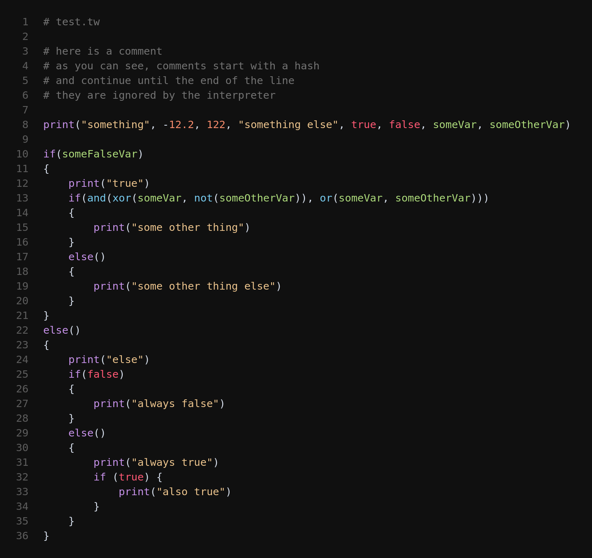

<!-- markdownlint-disable MD033 -->
<!-- markdownlint-disable MD041 -->

# VSCode-Taskwrappr

VSCode-Taskwrappr is a versatile Taskwrapper scripting language support extension for Visual Studio Code. It provides syntax highlighting and code snippets for the language.

## Features

- **Syntax Highlighting**: Enhances readability by applying different colors to keywords, operators, literals, variables, and custom functions.
- **Code Snippets**: Speeds up coding with handy snippets for common Taskwrappr patterns.

## Installation

1. Open Visual Studio Code.
2. Go to the Extensions view by clicking on the Extensions icon in the Activity Bar on the side of the window or by pressing `Ctrl+Shift+X`.
3. Search for `Taskwrappr`.
4. Click `Install`.

Alternatively, you can install the extension by downloading it from the [Visual Studio Code Marketplace](https://marketplace.visualstudio.com/vscode).

## Usage

1. Open a file with the `.tw` extension.
2. Enjoy enhanced syntax highlighting and code snippets specifically designed for Taskwrappr.

## Development

To contribute to the development of this extension:

1. Clone the repository:

    ```sh
    git clone https://github.com/smugg99/taskwrappr.git
    ```

2. Open the cloned repository in Visual Studio Code.
3. Run the extension in development mode by pressing `F5`.

<p align="center">
    
</p>

## Issues

If you encounter any issues or have suggestions for new features, please open an issue on the [GitHub repository](https://github.com/smugg99/vscode-taskwrappr/issues).

## License

This extension is licensed under the MIT License. See the [LICENSE](https://github.com/smugg99/taskwrappr/blob/main/LICENSE) file for more details.

---

Thank you for using VSCode-Taskwrappr! If you find this extension helpful, please consider giving it a star on GitHub and leaving a review in the Visual Studio Code Marketplace.
